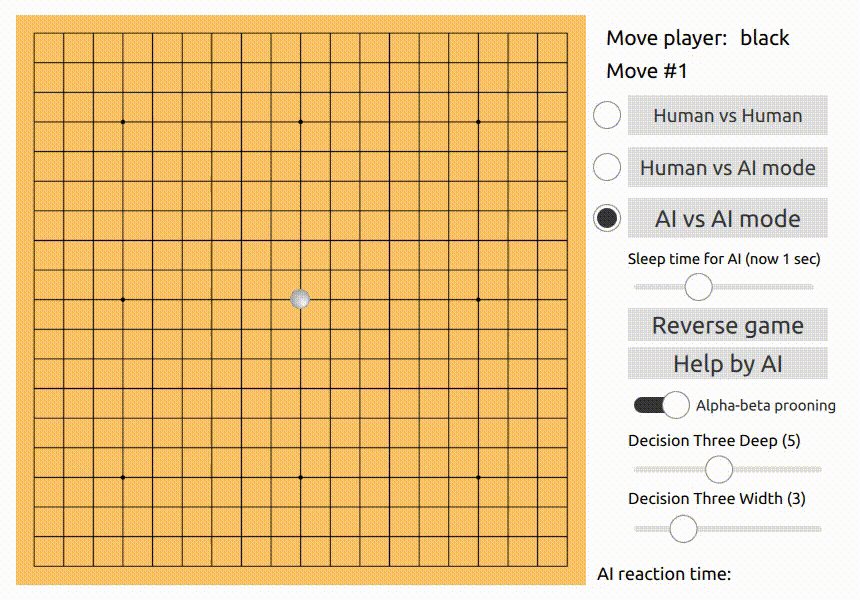

# Gomoku
**[Gomoku](https://en.wikipedia.org/wiki/Gomoku)** is a strategy board game traditionally played on a [Go](https://en.wikipedia.org/wiki/Go_(game)) board
with stones of two different colors.



## Installation Guide
Before compiling, please, install all dependencies of project and `Qt5` with `Qml`.

For that use `requirements.sh` shell script
```shell
> ./requirements.sh
```

To compile the project you can use `make.sh` shell script
```shell
> ./make.sh
```
Or run next commands in the bash
```shell
> qmake Gomoku.pro
> make -j8
```

